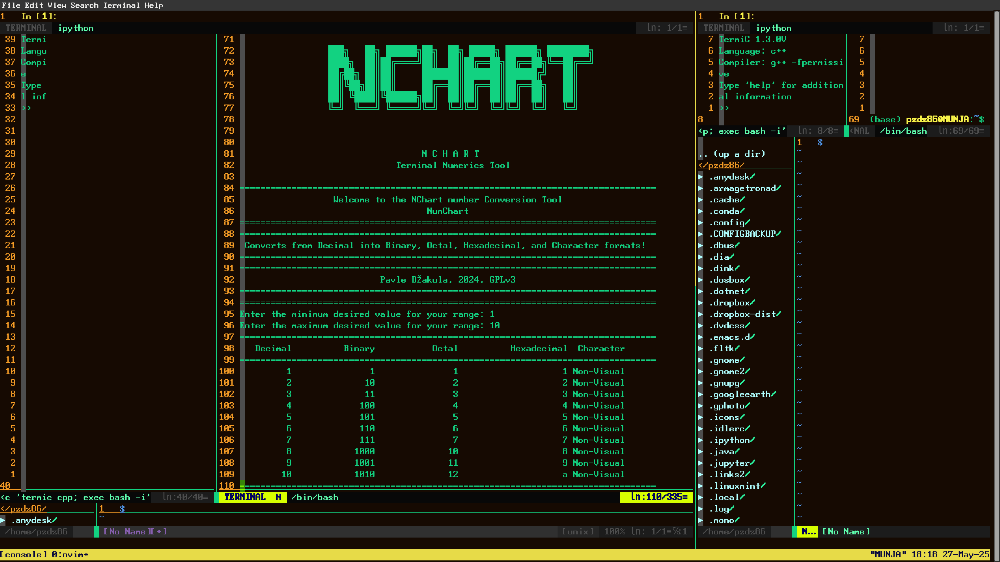
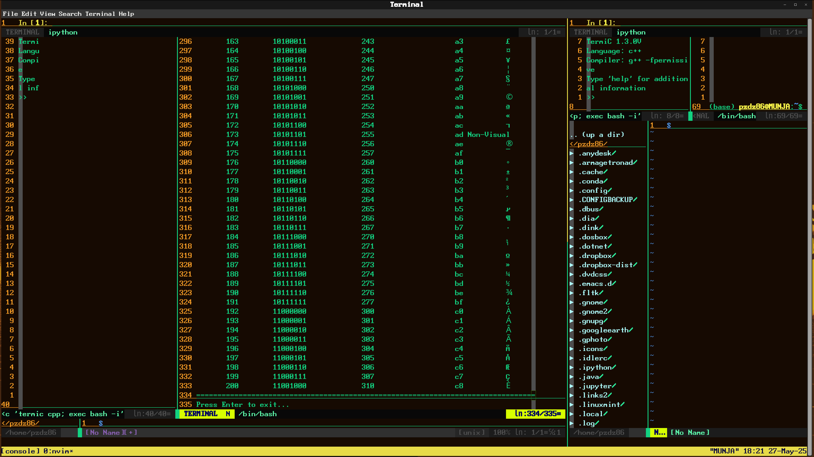

## License

NChart is licensed under the GNU General Public License v3.0 or later.  
See the [LICENSE](./LICENSE) file for full details.

# NChart

**A number system converter for your terminal.**  
Part of the [Tide42](https://github.com/logicmagix/Tide42) ecosystem — a modular terminal IDE for command-line enthusiasts.

## About NChart

NChart is a terminal-based number system converter and visualization tool.
It transforms decimal values into their binary, octal, hexadecimal, and ASCII character representations, displaying them in a clean, tabular format.

Designed for programmers, educators, and curious tinkerers, NChart can be used as a quick CLI tool or loaded into an IPython buffer for interactive experimentation within the Tide42 terminal IDE.

Whether you're working with character encoding, debugging raw values, or just exploring number systems, NChart gives you a simple and powerful way to see the math behind the machine.

## Features

- Convert integers into:
  - Binary
  - Octal
  - Hexadecimal
  - ASCII Character (when printable)
- Clean tabular output
- Works as a standalone CLI script *or* editable live in IPython/Tide42

## Installation
Simple clone the repo or extract the zip, make executable and run ./install.sh to use NChart standalone or within [`Tide42`](https://github.com/logicmagix/Tide42)

## Tips

        

## Screenshots

### NChart Interface

### NChart Output

## Usage

Simply type nchart

